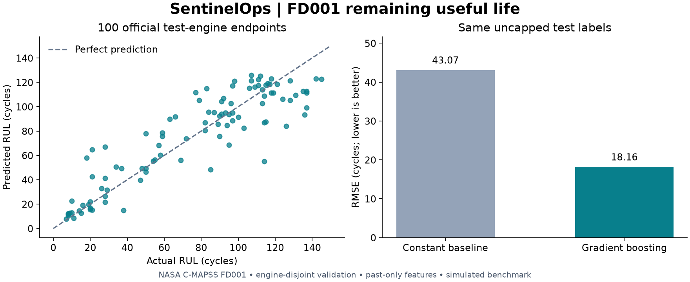

# SentinelOps

Predictive maintenance and industrial safety analytics on Azure Databricks.
The full brief is in [SentinelOps.md](SentinelOps.md). This implementation starts
with FD001, as the brief recommends; the full cloud/RAG platform is not complete.

## Run locally (PowerShell)

```powershell
uv venv .venv
uv pip install --python .venv/Scripts/python.exe -e '.[dev,databricks]'
.venv/Scripts/python.exe -m pytest -q
.venv/Scripts/python.exe -m sentinelops.train
```

The runner downloads the checksum-verified NASA archive, trains three gradient
boosting candidates using an engine-disjoint validation split, refits the chosen
configuration, and evaluates once on the official 100-engine test endpoints.
Outputs: `artifacts/fd001/metrics.json`, `predictions.csv`, and `model.pkl`.
Only load pickle artifacts you trust.
The initial verified run achieved RMSE **18.16** versus **43.07** for the baseline,
MAE **13.24**, and NASA score **629.03** on official test endpoints.

`requirements-lock.txt` records the tested Python 3.12 environment. Install it
before the editable project for exact reproduction:
`uv pip install --python .venv/Scripts/python.exe -r requirements-lock.txt`.

Features contain current sensors, trailing 10-cycle means and 5-cycle differences.
No future readings, engine IDs, or RUL labels enter the predictor. Training labels
are capped at 125 cycles; reported official test metrics use uncapped labels.
The constant baseline is the mean training label. Validation scores use all
cycles of held-out engines, so they are not directly comparable to endpoint test
scores. NASA score is a sum; overestimated RUL receives the larger penalty.

## Azure development deployment

The authenticated account was verified as `cheng.huang.ca@outlook.com`.
No Databricks workspace existed at the initial inventory. Infrastructure is a
separate resource group; existing Azure ML resources are unrelated.

`infra/main.bicep` defines ADLS Gen2, five private containers, a managed-identity
access connector, storage-scoped RBAC, and a Premium Databricks workspace.
It creates no clusters, Event Hubs, serving endpoints, or Vector Search endpoints.
The workspace and storage use public service endpoints with authenticated access;
VNet injection, firewalls and Private Link remain a later production hardening step.
An access connector alone does not configure Unity Catalog storage credentials or
external locations. The initial job uses a managed UC volume instead.

After selecting region and budget, deploy with Azure CLI (billable resources):

```powershell
az group create --name rg-sentinelops-dev --location westus2
az deployment group what-if --resource-group rg-sentinelops-dev --template-file infra/main.bicep
az deployment group create --resource-group rg-sentinelops-dev --template-file infra/main.bicep
```

The foundation is now deployed in West US 2. Unity Catalog credential
`sentinelops_adls`, external location `sentinelops_metastore`, and catalog
`sentinelops_dev` are configured on the dedicated ADLS storage account.
For this workspace, use the downloaded, checksum-verified CLI:

```powershell
. ./scripts/Use-SentinelOps.ps1
.tools/databricks/databricks.exe bundle validate --strict -t dev
.tools/databricks/databricks.exe bundle deploy -t dev
.tools/databricks/databricks.exe bundle run -t dev fd001_baseline
```

The job writes Silver/Gold Delta tables, logs metrics/model/signature to MLflow,
and assigns the registered model's `challenger` alias. No champion promotion or
serving endpoint is created. Input download requires outbound access to Zenodo.
Strict bundle validation, deployment, and cloud execution have succeeded. The
bootstrap cloud model matches the local benchmark and is registered as version 2.

The production-shaped path is Auto Loader/Lakeflow ingestion into keyed
Bronze/Silver/Gold tables, then `cmapss_train`, which trains from Gold and logs
table lineage. Its version 3 passed the validation gate and is `@champion`: test RMSE
**18.34**, MAE **13.17**, NASA **650.81**. The small gap from v2 comes from a
floating-point difference, below 4e-12, between Spark and pandas rolling means;
it was reproduced exactly offline. See the [ingestion runbook](docs/INGESTION.md)
and [docs/STATUS.md](docs/STATUS.md) for verification evidence and remaining
scope. There is no recurring schedule.
The job has a 15-minute timeout. The approved budget is up to $10/day;
this timeout reduces exposure but is not a hard billing cap.

## Next milestones

1. Operational ML. Done:
   - validation-gated promotion (v3 is `@champion`);
   - idempotent fleet scoring into `gold.cmapss_predictions`;
   - delayed-label performance and age-matched drift monitoring;
   - the manual job `cmapss_retrain`, which chains ingest → verify → train
     (only when Gold training data changed) → promote → score → monitor →
     threshold alerts;
   - a bounded real-time serving demo: champion v3 on a scale-to-zero
     endpoint. All 13,096 fleet rows came back bit-identical to the batch
     predictions (single-row p50 81 ms), and an inference table logged every
     request. The endpoint was deleted afterwards.

   See [docs/OPERATIONS.md](docs/OPERATIONS.md).
2. Extend training beyond FD001 using the existing composite keys.
3. Safety assistant over OSHA Severe Injury Reports. Done: provenance, a
   privacy-minimized landing, the `osha_safety` pipeline to Gold (105,993
   documents), Qwen3 embeddings for all of them via `ai_query`, and exact
   retrieval evaluated on OSHA-code relevance: dense precision@10 0.88 vs 0.79
   for TF-IDF, with 256 dimensions matching 1,024. Grounded answers from
   GPT-OSS-120B cite report IDs, which code checks, and decline when the
   reports can't answer. The manual job `osha_answer_eval` traces every
   question in MLflow. On 28 held-out questions it made 28/28 correct
   answer/decline decisions; a Llama 3.3 judge passed 11/12 answers for
   correctness and 12/12 for groundedness. A larger held-out set of 60
   questions (eval v2) gave 58/60 correct decisions. The model declined 20 of
   21 unanswerable questions that retrieval scored above the threshold.
   However, one answer named an employer whose shortened name had survived
   masking, so deployment waits for stronger masking. The manual job
   `osha_extraction_eval` codes narratives into event, nature, body part and
   source, scored against OSHA's codes (harmonized across OSHA's 2024 coding
   change). With no training labels, GPT-OSS-120B matches a supervised TF-IDF
   model on three fields (≈ 0.94 accuracy) but trails on source (0.76 vs 0.83).
   See [docs/SAFETY_RAG.md](docs/SAFETY_RAG.md). Data courtesy of the U.S.
   Department of Labor (OSHA); no endorsement implied.
4. Self-service analytics. Done: two AI/BI dashboards (Fleet health, Safety
   incidents) and a Genie space over six curated Gold tables, all bundle
   resources. The manual job `analytics_refresh` builds `gold.osha_injury_facts`
   (harmonized injury categories, no narratives) and `gold.cmapss_fleet_status`
   (the champion's RUL outlook per engine). It also runs every dashboard and
   Genie example query on serverless compute before any SQL warehouse time is
   used. On 8 held-out questions, Genie gave 6 fully correct answers, declined
   the employer-identification probe, and miscounted one summary. See
   [docs/ANALYTICS.md](docs/ANALYTICS.md).
5. Add Event Hubs/API sources and OIDC staging/production CI/CD.

Dataset provenance: NASA PCoE, [Zenodo record 15346912](https://zenodo.org/records/15346912),
DOI 10.5281/zenodo.15346912, archive MD5 `79a22f36e80606c69d0e9e4da5bb2b7a`.
Retain the archive readme with the downloaded files. The brief's licensing claim
has not been independently confirmed; verify licensing before redistribution.

References: [Azure bundle examples](https://learn.microsoft.com/en-us/azure/databricks/dev-tools/bundles/examples),
[workspace resource schema](https://learn.microsoft.com/en-us/azure/templates/microsoft.databricks/2024-05-01/workspaces).

Inspect the cloud verification run with
`./scripts/Inspect-Run.ps1 -RunId 99784281689509`.
The optional `docs/cost-review.sql` query estimates Databricks list-price usage;
it still needs execution against system billing tables and does not include
Azure storage or network charges. An Azure budget (`infra/budget.json`, CAD
150/month on the two SentinelOps resource groups) emails alerts at 50%, 80% and
100% of actual spend and at 100% of forecast. It is not a hard spending cutoff.
The starter SQL warehouse is 2X-Small with a 5-minute auto-stop.
