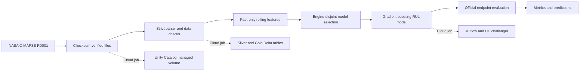
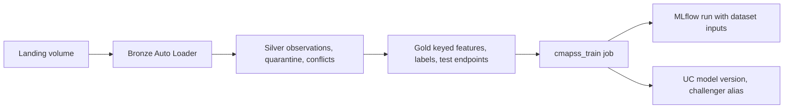

# Architecture and delivery boundaries

Solid paths have run successfully locally. All dotted cloud paths are now also
verified: managed volume, Delta writes, training, metric tracking, and UC model
registration with a challenger alias. See STATUS.md for the successful run.

## Evaluation contract

The training file contains run-to-failure sequences. Each row's target is its
engine's final cycle minus current cycle, capped at 125. Validation holds out
whole engines. Hyperparameters are selected without reading official test labels.
The final model trains on all training engines. Its evaluation uses one endpoint
per test engine and the corresponding official uncapped RUL label.

Unit identity is not a feature. All window features include only current/past
readings from the same engine. The fitted model expects the engineered feature
columns; a future serving endpoint must either accept that feature contract or
retrieve history before computing it. It cannot correctly score a single raw
sensor row as if it already had ten cycles of history.

## Cloud foundation

- Separate resource group and managed resource group for SentinelOps.
- ADLS Gen2, authenticated access only, shared account keys disabled.
- Access connector's system-assigned identity has Blob Data Contributor scoped
  to this storage account, not subscription-wide permissions.
- Premium workspace with no public IPs for classic compute nodes.
- Public service endpoints remain enabled; Private Link is not implemented.
- No dedicated compute, recurring schedule, serving, or Vector Search resources
  are provisioned by the foundation template.

## Medallion ingestion extension

The triggered Auto Loader/Lakeflow graph is defined in `pipelines/medallion.py`.
It reuses managed ADLS storage and the bootstrap landing volume, adds separate
Bronze/Silver/Gold schemas, quality quarantine and conflict detection, and declares
composite feature keys. See [INGESTION.md](INGESTION.md) for contracts and
[STATUS.md](STATUS.md) for actual cloud verification evidence.

`jobs/train_medallion.py` (bundle job `cmapss_train`) is the medallion training
path. For one subset it reads Gold features, capped training labels and official
test endpoints; requires a one-to-one key join between training features and
labels; restores bootstrap row order; and reuses the same engine-disjoint
selection (`sentinelops.model.select`). It logs content digests of the exact
rows used, MLflow dataset inputs naming the Gold tables, upstream quarantine and
conflict counts, and registers a tagged version under the `challenger` alias.
The bootstrap job `fd001_baseline` and model version 2 remain unchanged.
Training reads current Gold state without pinning table versions (the digests
record what was used), so run it after, not during, an ingestion update; the
alignment checks reject most mixed reads.

Spark's windowed `avg` and pandas' `rolling().mean()` agree to within 4e-12,
not bit-for-bit. That was enough to move the v3 test RMSE from 18.16 to 18.34.
Scoring and serving must therefore compute features with the Gold (Spark)
logic that trained the model. The pandas `features()` function remains the
reference for local tests and the bootstrap.

## Full-platform work still required

Training consumes the Gold tables. A validation-gated promotion job,
idempotent fleet batch scoring into a timestamped inference log, and
delayed-label monitoring are in place (see [OPERATIONS.md](OPERATIONS.md)).
Orchestrated retraining (`cmapss_retrain`), threshold alerts and a bounded
real-time serving demo followed.
Additional external locations are deferred until a source needs access outside
the existing managed volume. Do not repeatedly tune against the fixed official
test set; the fleet monitoring metrics reuse those engines.

Safety RAG ([SAFETY_RAG.md](SAFETY_RAG.md)) has its own pipeline,
`osha_safety`. Checksummed OSHA reports are minimized locally, with employer,
address and location fields removed and masked in narratives, then landed and
ingested through Bronze → Silver (with quarantine) → Gold `osha_documents`,
keyed by `report_id`, which is the citation key. Retrieval will be exact
cosine search over pay-per-token embeddings stored in Delta, because a
Vector Search endpoint alone costs ~CAD 9.3/day. Incident similarity alone does
not establish causes or regulatory compliance.

REST API ingestion has its own pipeline, `weather_open_meteo`. The
`weather_ingest` job fetches Open-Meteo daily ERA5 weather within a
weighted-call budget and lands the raw responses unchanged in
`landing/open_meteo/v1`, never overwriting a file. Auto Loader then builds
Bronze → Silver (with quarantine) → Gold `weather_state_monthly`, keyed by
state and month like OSHA's reports. A verify task recomputes the tables from
the raw files. See [INGESTION.md](INGESTION.md#rest-api-ingestion-open-meteo-weather).
